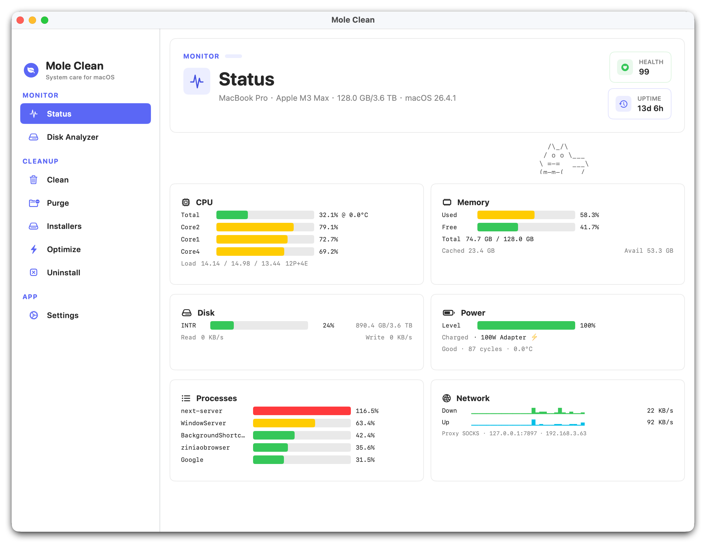
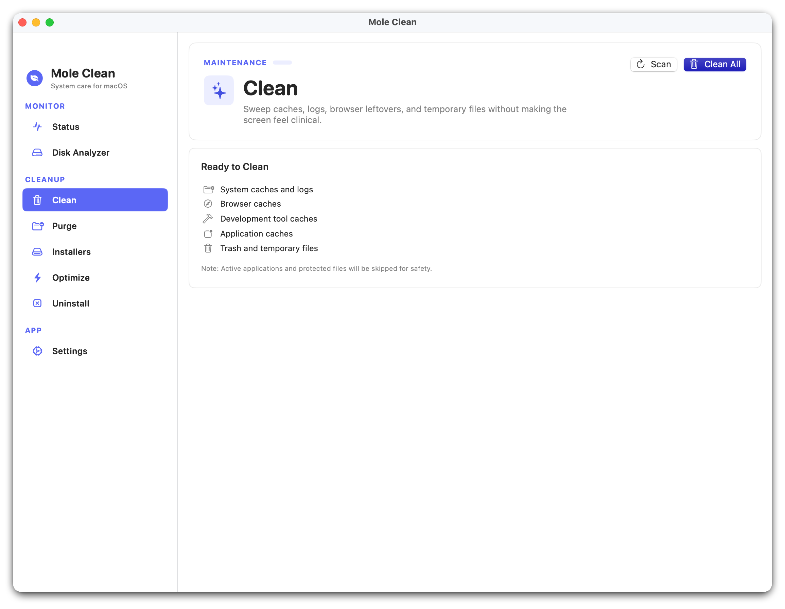
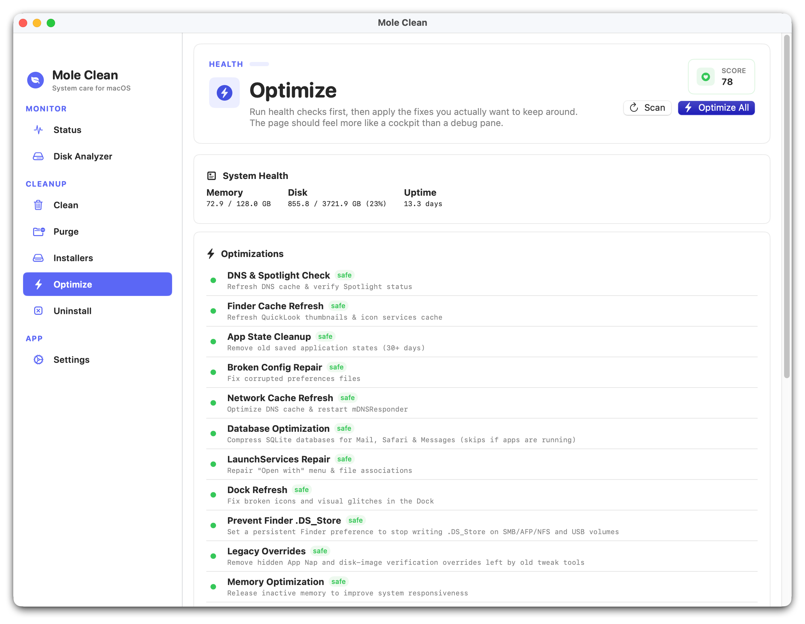
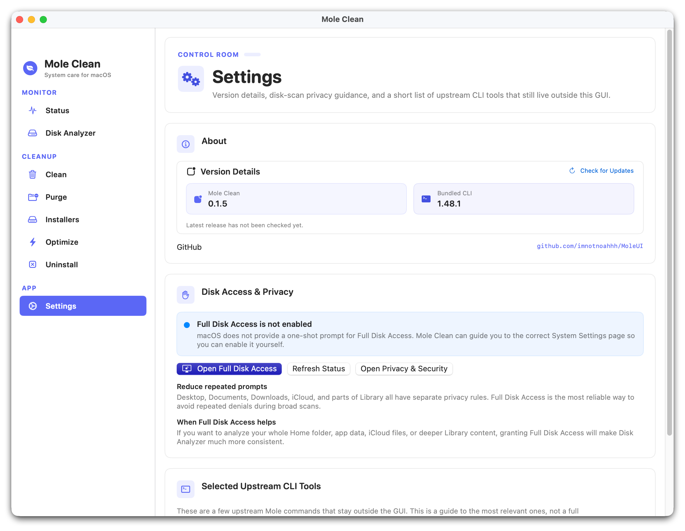

# Mole Clean

Mole Clean 是一个基于 SwiftUI 的 macOS 系统维护工具，使用上游 [Mole](https://github.com/tw93/Mole) CLI 作为清理引擎。

当前项目处于早期开发阶段。清理操作请先使用 Dry Run，并确认目标后再执行。

## 界面预览









## 当前主线

- `main/blue-theme`：默认稳定开发主线，UI、Mole CLI 更新和发行修复都在这里进行。
- `main-moleui`：从原仓拉入后的原始基线，只用于对照和回溯。
- `auto-update-mole-*`：上游内核升级时的临时分支，合并后删除。

## 文档与构建

- [应用 README](code/README.md)：功能、架构、开发和贡献说明
- [项目文档](docs/README.md)：决策、架构、上游同步和实施资料
- [GitHub Actions 构建指南](docs/build.md)：CI、DMG、签名、Mole CLI 更新和 macOS 首次打开处理

## 快速开始

```bash
git clone https://github.com/ifengz/MoleClean.git
cd MoleClean/code
open MoleUI.xcodeproj
```

也可以直接从 [GitHub Releases](https://github.com/ifengz/MoleClean/releases) 下载 DMG。
